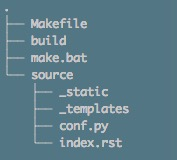
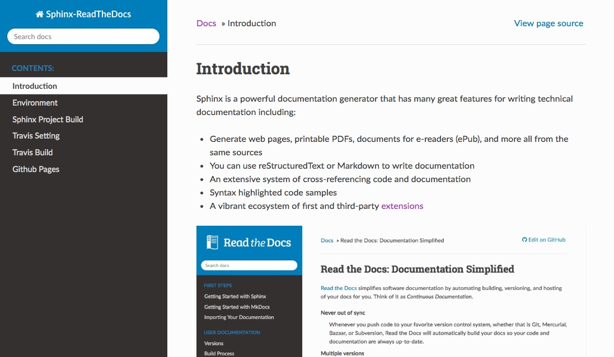
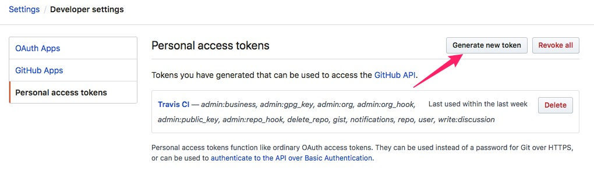
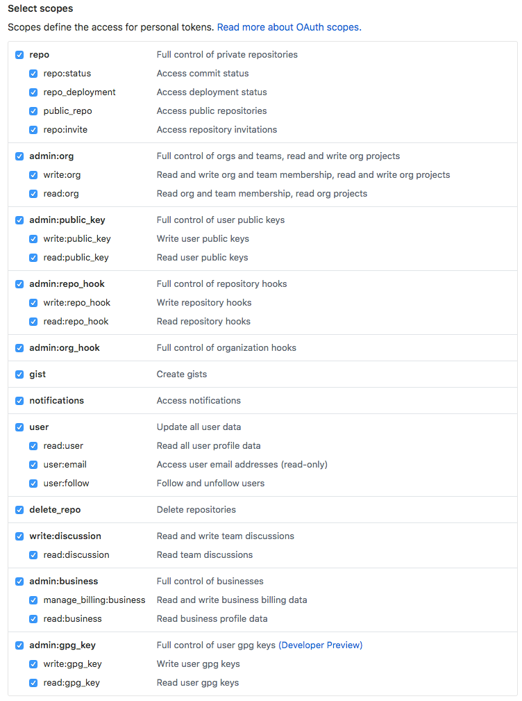

# Sphinx Project Build
## Outline
* Sphinx initialization
* git initialization
* GitHub tocken

## Sphinx initialization
Getting started is super easy.
```
mkdir my-project
cd my-project
sphinx-quickstart
```

```
> Separate source and build directories (y/n) [n]: y
> Project name: Sphinx-ReadTheDocs
> Author name(s): seel
> Project release []: 1.0.0
> Project language [en]:
```

There's a single configuration file named `index.rst`, and a folder named `source` that will contain your documentation source files.


**Change theme `sphinx_rtd_theme`**
Change `source/conf.py`:
```Python
import sphinx_rtd_theme
html_theme = "sphinx_rtd_theme"
html_theme_path = [sphinx_rtd_theme.get_html_theme_path()]
```

You can not start serve like gitbook or MkDocs. You can only build the web by the following step:
```
make html
```

Go to the `build/html` directory and open `index.html` with your browser.


**Markdown Support**
By installing `recommonmark` to support markdown
```
pip install recommonmark
```
and edit `conf.py`
```
from recommonmark.parser import CommonMarkParser
source_parsers = {
    '.md': CommonMarkParser,
}
source_suffix = ['.rst', '.md']
```

## Git Initialization
Enter `<your project>` folder through the terminal.
```
git init
git add .
git commit -m "Basic Sphinx files"
```
## GitHub Tocken
We need `GITHUB_TOKEN` for Travis to build Mkdocs. So we generate one in [Personal access tokens](https://github.com/settings/tokens).(or you can go `Settings -> Developer settings -> Personal access tokens` to generate one).



And make sure click every selection.



Copy the token we generated for later use.
