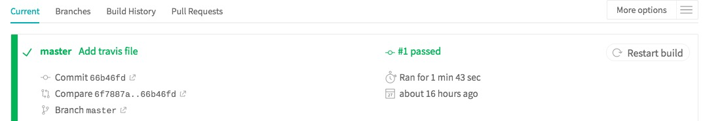

# Travis Build
## Outline
* Mkdocs-building script
* project upload
* Travis build Mkdocs

## Mkdocs-building Script
Enter `<your project>` folder through the terminal, and generate travis setting file：
```
cd <your project PATH>
nano .travis.yml
```
```
language: python

python:
  - 3.6

before_install:
  - export TZ='Asia/Shanghai'

install:
  - pip install sphinx sphinx-autobuild sphinx_rtd_theme
  - pip install recommonmark

script:
  - make html

branches:
  only:
    - master

deploy:
  provider: pages
  skip_cleanup: true
  github_token: $GITHUB_TOKEN
  name: $GIT_NAME
  email: $GIT_EMAIL
  local_dir: site
  on:
    branch: master

```

## Project Upload
After generating the travis setting file, we need to push it on GitHub.
```
git add .travis.yml
git commit -m "Travis setting file"
git push
```

## Travis Build Mkdocs
Enter our repository in [Travis](https://travis-ci.org/) and build our repository.
It will use our setting file `.travis.yml` to build the Mkdocs website.
If everything goes well, it should be in green.


